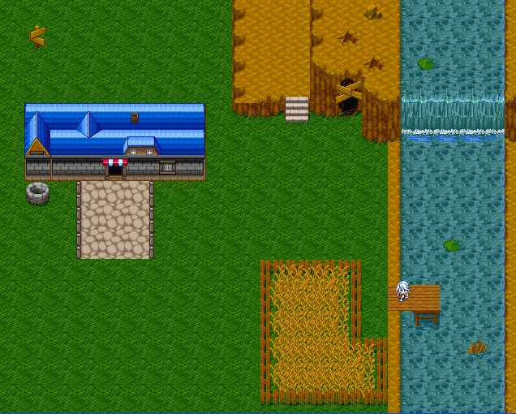

<div align="center">

## RPG Engine


</div>

### Description

This is a RPG engine when i've got the collisionw work then i will make it a game,.. i want to ask help because i don't get the collision work properly

So. .anybody.?:P please tell me how to fix it,.
 
### More Info
 
arrows

pleasure...

at the moment the collision bug


<span>             |<span>
---                |---
**Submitted On**   |2006-07-27 15:04:48
**By**             |[Gh€ttoWarr\!or](https://github.com/Planet-Source-Code/PSCIndex/blob/master/ByAuthor/gh-ttowarr-or.md)
**Level**          |Advanced
**User Rating**    |5.0 (10 globes from 2 users)
**Compatibility**  |VB 6\.0
**Category**       |[Games](https://github.com/Planet-Source-Code/PSCIndex/blob/master/ByCategory/games__1-38.md)
**World**          |[Visual Basic](https://github.com/Planet-Source-Code/PSCIndex/blob/master/ByWorld/visual-basic.md)
**Archive File**   |[RPG\_Engine2009327282006\.zip](https://github.com/Planet-Source-Code/gh-ttowarr-or-rpg-engine__1-66111/archive/master.zip)

### API Declarations

```
Public Declare Function GetAsyncKeyState Lib "user32" Alias "GetAsyncKeyState" (ByVal vKey As Long) As Integer
```


